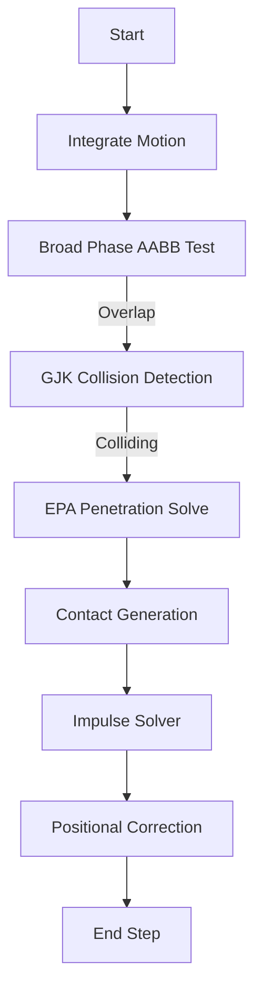

# Physics Engine (3D Rigid Body)
---
## Introduction:

A lightweight 3D rigid body physics engine written in **Python**, focusing on **collision detection**, **contact generation**, and **impulse-based resolution**.

This project is designed as a learning-oriented and research-oriented engine with clear algorithmic structure and explicit physical modeling.

---

## Release:
Precompiled executables for this engine can be found at the [releases page](https://github.com/EMEEEEMMMM/AtlasPhys/releases) for Windows and Linux.

---

## Features:

- [x] 3D rigid body dynamics (linear + angular)
- [x] Semi-implicit Euler integrator
- [x] Gravity and basic for accumulation
- [x] Collision detection:
    - Plane-Cube
    - Plane-Sphere
    - Cube-Sphere
    - Cube-cube
    - Sphere-Sphere
- [x] Contact generation
- [x] Acceleration & Impulse visualization (Arrows in red and green) 
- [x] Based on OpenGL and Pyqt6
- [x] Interactive demo (camera control, object generation)

---

## Simulation pipeline

Each physics step/frame follows this order:

1. **Integration**
    - Semi-implicit Euler
    - Updates velocity -> position
    - Updates angular velocity -> orientation
    - Updates for the *Arrows*
  
2. **Broad Phase**
    - Simple AABB overlap test
  
3. **Narrow Phase**
    - GJK for collision detection
    - EPA for penetration depth & contact normal
  
4. **Contact Generation**
    - Analytical contacts for simple shapes
    - Face selection + polygon clipping for Cube-Cube

5. **Constraint Solving**
    - Impulse-based normal resolution
    - Iterative solver

6. **Positional Correction**
    - Baumgarte-style correction to prevent sinking

---

## Physics Model

### **Integrator**:

$$ a = g $$
$$ {v_{t + \Delta t}} = {v_t} + a\Delta t $$
$$ {x_{t + \Delta t}} = {x_t} + {v_{t + \Delta t}}\Delta t $$
$$ \tau  = I\alpha $$
$$ {\omega _{t + \Delta t}} = {\omega _t} + I_{world}^{ - 1}\tau \Delta t $$
$$ {\theta _{t + \Delta t}} = {\theta _t} + {\omega _{t + \Delta t}}\Delta t $$
$$ I_{world}^{ - 1} = RI_{body}^{ - 1}{R^T} $$

### **Impulse**:
$$
\begin{align}
{r_A} = P - {x_A},{r_B} = P - {x_B}\\
{v_{P,A}} = {v_A} + {\omega _A} \times {r_A},{v_{P,B}} = {v_B} + {\omega _B} \times {r_B}\\
{v_{rel}} = {v_{P,B}} - {v_{P,A}}\\
{v_n} = {v_{rel}} \cdot n\\
J = jn\\
v_A' = {v_A} - \frac{j}{{{m_A}}}n,v_B' = {v_B} + \frac{j}{{{m_B}}}n\\
\omega _A' = {\omega _A} - I_A^{ - 1}\left( {{r_A} \times jn} \right),\omega _B' = {\omega _B} + I_B^{ - 1}\left( {{r_B} \times jn} \right)\\
v_{P,A}' = v_A' + \omega _A' \times {r_A},v_{P,B}' = v_B' + \omega _B' \times {r_B}\\
v_{rel}' = v_{P,B}' - v_{P,A}'\\
v_{re{l^\prime }} \cdot n =  - e\left( {{v_{rel}} \cdot n} \right)\\
j =  - \frac{{\left( {1 + e} \right){v_{rel}} \cdot n}}{{\frac{1}{{{m_A}}} + \frac{1}{{{m_B}}} + n \cdot \left[ {\left( {I_A^{ - 1}\left( {{r_A} \times n} \right)} \right) \times {r_A} + \left( {I_B^{ - 1}\left( {{r_B} \times n} \right)} \right) \times {r_B}} \right]}}
\end{align}
$$

### **Positional Correction**:
$$
\ Correction = percent \times \max \left( {penetration - slop,0} \right)/InvMassSum 
$$
